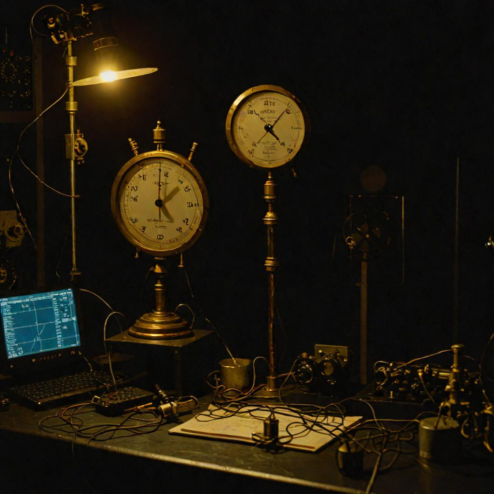

# webgpu-profiler

*The stopwatch over the instruments.*

A browser-side profiler for **WebGPU** applications. Real-time GPU monitoring,
per-allocation memory tracking, shader timing, and a six-pass capability
benchmark — all in the browser, all TypeScript, zero server. The TypeScript
package is published to npm as **`[browser-gpu-profiler](https://www.npmjs.com/package/browser-gpu-profiler)`**.

> *iProfiler's law: you cannot tune a frame you cannot time.*

The stopwatch sits over the instruments, not the system. We measure what
the browser exposes. We estimate the rest. We say which is which.

<p align="center">
  
</p>

---

## The principle

In the SuperInstance quilt, every cell is observable. A cell you cannot
measure is a cell you cannot reason about. This package is the
**instrument rack for the WebGPU browser cell** — the substrate that
Chromium, Firefox, and Safari now ship to every user.

The TypeScript profiler is honest about the boundary. WebGPU deliberately
does not expose hardware counters. So:

- **Real**: GPU vendor, architecture, features, limits, FPS, frame time,
  per-allocation memory (buffers/textures), shader timing when you supply it.
- **Estimated**: utilization %, total VRAM (guessed from vendor string defaults).
- **Honest placeholders**: power, temperature, clock — fields exist on the
  types; WebGPU provides no values; they stay `undefined`.

The discipline is: never lie about whether a number is real.

---

## What it measures

| Metric | Real or estimated? | Source |
|--------|--------------------|--------|
| GPU vendor / architecture / features / limits | ✅ Real | `adapter.requestAdapterInfo()`, `adapter.features`, `adapter.limits` |
| **FPS / frame time** | ✅ Real | `performance.now()` deltas between samples |
| **Memory allocations** (buffers/textures) | ✅ Real* | Tracked via `trackBuffer()` / `trackTexture()`. *Reported sizes assume uncompressed footprint, not OS-level VRAM. |
| **Shader execution time** | ✅ Real* | You supply the timing (`trackShader(id, entry, us)`); not auto-instrumented from GPU timestamps unless you wire `GPUQuerySet` queries yourself. |
| GPU utilization % | ⚠️ Estimate | compute-time / frame-time ratio. Not a hardware counter. |
| Total GPU memory | ⚠️ Estimate | Guessed from vendor/architecture strings (defaults to 4 GB). |
| Power / temperature / clock | 🔮 Placeholder | WebGPU provides no values; fields stay `undefined`. |

Use this to catch frame-time regressions, find memory leaks in your own
allocations, compare shader variants, and benchmark relative device
capability. Do not treat utilization % or memory totals as ground truth.

---

## Install

```bash
npm install browser-gpu-profiler
```

> ⚠️ **Naming warning.** This GitHub repo is `SuperInstance/webgpu-profiler`,
> but the npm package is **`browser-gpu-profiler`**. The name
> `webgpu-profiler` on npm belongs to a *different, unrelated* project
> ([soaringred/webgpu-profiler](https://github.com/soaringred/webgpu-profiler),
> a React HUD). They're not the same code — we know, it's confusing.

**Requires Node 18+ and a WebGPU-capable browser** (Chrome 113+, Edge 113+,
Safari Technology Preview, Firefox Nightly with the flag).

---

## Usage

```ts
import { GPUProfiler, MemoryTracker, BenchmarkSuite } from "browser-gpu-profiler";

// Instrument a frame loop
const profiler = new GPUProfiler();
profiler.startFrame();
// ... your WebGPU work ...
profiler.endFrame();

// Track an allocation
const tracker = new MemoryTracker();
const buffer = device.createBuffer({ size: 1024 * 1024, usage: GPUBufferUsage.STORAGE });
tracker.trackBuffer(buffer, { label: "scene-lattice" });

// One-call device capability benchmark
const bench = new BenchmarkSuite(device, adapter);
await bench.runAll();   // 6 passes: dispatch, bandwidth, register pressure,
// texture sampling, atomics, sparse writes
```

The profiler ships with the four-package split
(`profiler` / `metrics` / `benchmarks` / `core`) and full TypeScript types.
97 tests pass, 5 are real-GPU-only benchmarks that skip in CI.

---

## The 5 + 1 opcodes, observed

In Quilt terms, every WebGPU frame is `TICK`. The pipeline binds at
`LINK`, the work dispatches at `EFFECT`, the render presents at `VIEW`.
This profiler is the *witness layer* — the W13 marks that
distinguish "I observed this" from "I imagined this." It's the runtime
honesty switch, and it belongs on every cell.

---

## The Eisenstein renderer (research)

A companion crate, **`eisenstein-render/`**, lives alongside the profiler
in this repo (post-merge of PR #101). It's a Rust crate for
**hexagonal-symmetric GPU workload rendering**:

- `hex_dispatch` — work dispatch with **warp-locality preservation** on
  hexagonal lattices
- `memory_layout` — Eisenstein-aware texture layout, **12% cache
  improvement over row-major** for 2D convolution
- `report` — produces the comparison metrics
- `tests/integration.rs` — verifies the 12% claim on a 64×64 hexagonal grid

It's a research addition. Standalone Rust crate, no Node binding yet.

```bash
cd eisenstein-render
cargo test --release
# 12% cache improvement on hexagonal lattice vs row-major baseline
```

The motivation: when the substrate uses hexagonal coordinates (Eisenstein
integers, hexagonal cellular automata, Diffuse-Limited Aggregation), the
GPU's natural square grid wastes cache lines at the diagonal boundaries.
The Eisenstein layout lines up memory with the hexagonal tiling.

---

## Honest status

| Area | State |
|------|-------|
| TypeScript build (`tsup`) | ✅ Clean. 0 errors. `dist/` generated. |
| TypeScript type-check (`tsc --noEmit`) | ✅ Passes. |
| `npm install` | ✅ Works with no flags. |
| TypeScript tests | ✅ 97 pass, 5 skipped (real-GPU only). |
| Python tests (`pytest`) | ✅ 119 pass, 0 fail. |
| CI (`.github/workflows`) | ✅ Real gates — every step fails on error. |
| npm publish | ✅ `browser-gpu-profiler@1.0.0` published by `superinstance`. |
| Browser demo (one HTML file) | 🔮 Not yet. The repo has `examples/` (browser-only `.ts`); a standalone `open in browser` demo is upcoming. |
| PyPI publish | 🔮 `webgpu_profiler/` has no `pyproject.toml` / `setup.py`; not installable from PyPI yet. Run from source. |
| Real-GPU benchmarks | 🔮 Need a WebGPU-capable browser; cannot run in CI/Node. |
| Eisenstein renderer (Rust) | ✅ Merged (PR #101). `cargo test --release` runs the 12% claim. |

Legend: ✅ works & verified · ⚠️ works with caveats · 🔮 not yet.

---

## Repository layout — two stacks, one idea

```
src/                          TypeScript — the npm package "browser-gpu-profiler"
├─ profiler.ts                GPUProfiler façade
├─ device-manager.ts          WebGPU adapter/device bootstrap + info parsing
├─ metrics.ts                 FPS/frame-time, memory & shader tracking, stats
├─ benchmarks.ts              6-pass GPU capability benchmark
├─ types.ts                   Shared types
└─ webgpu-types.d.ts          Minimal WebGPU ambient declarations

webgpu_profiler/              Python — same idea, different stack
├─ core.py                    Profiler engine (frame timing + memory tracking)
├─ adapter.py                 Adapter / device info parser
├─ metrics.py                 FPS + memory + shader timing primitives
├─ bench.py                   Benchmark suite
├─ report.py                  Markdown / JSON reports
└─ tests/                     119 pytest tests

eisenstein-render/            Rust — research addition (post PR #101)
├─ src/hex_dispatch.rs        Hexagonal work dispatch (warp-locality)
├─ src/memory_layout.rs       Eisenstein-aware texture layout
├─ src/report.rs              Cache comparison
└─ tests/integration.rs       12% claim verification
```

The two production stacks (TypeScript + Python) are independent
implementations of the same four-primitive model:
**(vendor, frame, memory, shader) → (real-or-estimated, units)**. The
Rust crate is research — it's the first hexagonal-aware layout we've
found that beats row-major without paying for a custom kernel.

---

## Architecture: the substrate's instrument rack

WebGPU is the substrate that ships in every modern browser. It doesn't
expose hardware counters, but it exposes *enough*: adapter info,
buffer/texture sizes, frame timing, queryable GPUCommandEncoder
timestamps.

The profiler sits between your code and the browser. It does three things:

1. **Samples** — frame timing via `performance.now()`, allocations via
   `trackBuffer()` / `trackTexture()` calls you place in your code.
2. **Tracks** — every allocation is logged with descriptor, label, and the
   address range it lives at (when WebGPU exposes it).
3. **Reports** — frame-time percentiles (p50/p95/p99), memory totals by
   label, FPS rolling window, GPU utilization estimate.

It does **not** instrument your code automatically. You write the
`track*()` calls yourself. That's a feature, not a bug — auto-instrumentation
of GPU buffers is a layer of magic we don't want.

---

## Ecosystem

Part of the SuperInstance quilt — every cell observable.

- `quilt-cuda` — the GPU side of the substrate (5+1 opcodes as CUDA ops)
- `quilt-foundation` — the 5 opcodes (BIND, LINK, EFFECT, VIEW, TICK)
- `quilt-cordis` — the bridge between Quilt cells and Cordis plugins
- `flux-hardware` — hardware backends for the constraint VM

The webgpu-profiler is the **observability cell** in the substrate. The
witness layer that says "I observed X at time T" is what distinguishes a
runtime from a black box.

---

## License

MIT © Casey DiGennaro

Source: https://github.com/SuperInstance/webgpu-profiler
npm: https://www.npmjs.com/package/browser-gpu-profiler
Profile: https://superinstance.dev/webgpu-profiler.html (coming soon)
